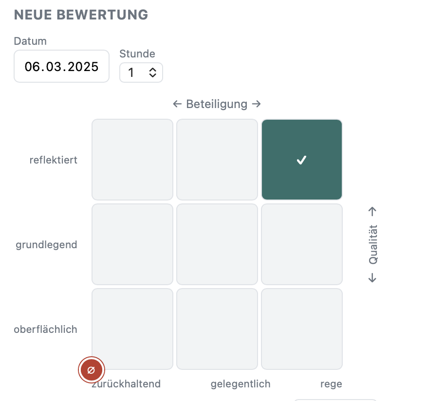
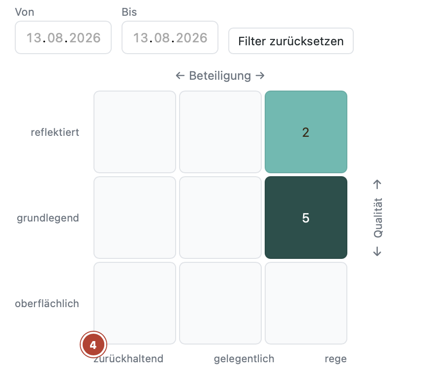
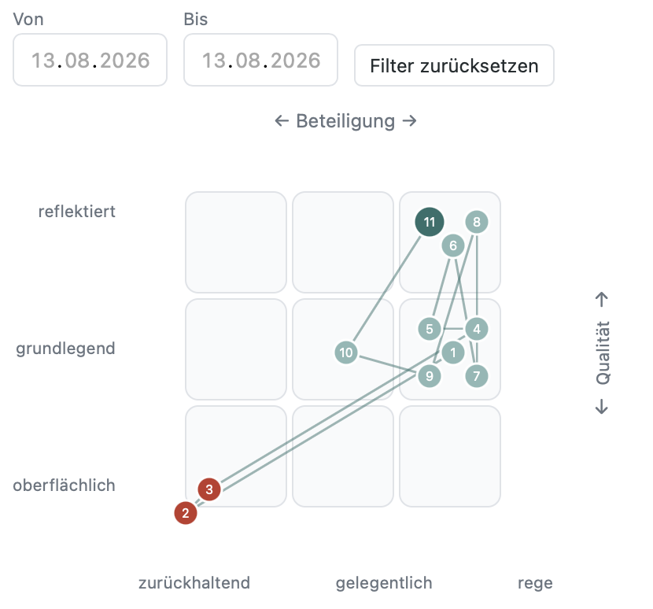
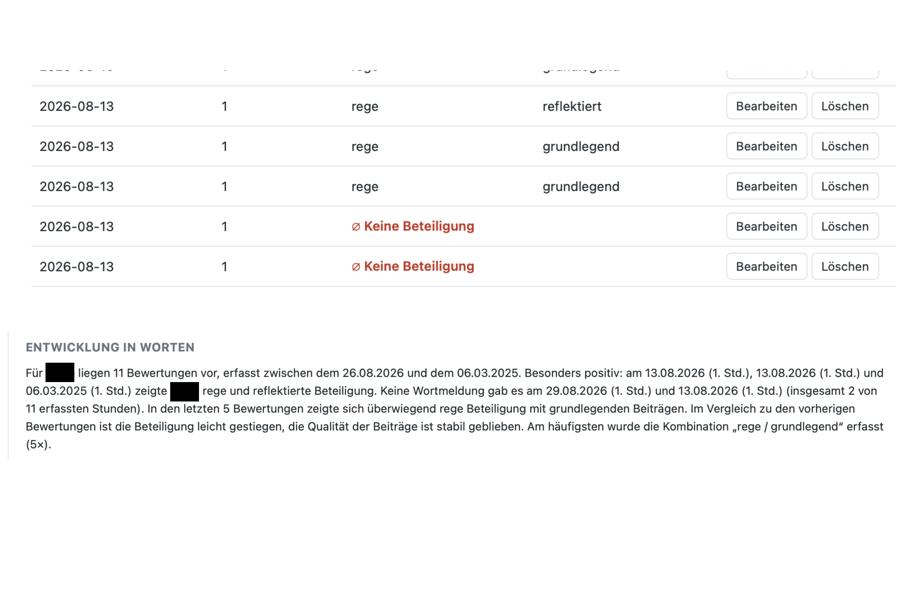
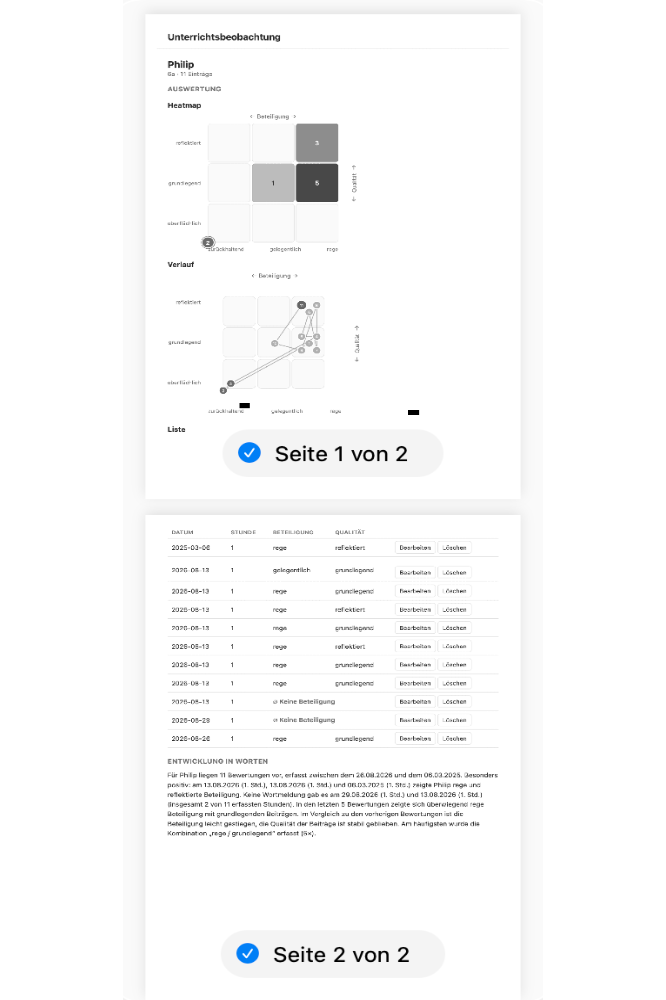

### **Mitarbeit - auf einen Blick**  

 
 

**Was bietet die App?**
<table> <tr> <td width="35%" valign="top"></td> <td valign="top">
Beteiligung schnell graphisch erfassen.
</td> </tr> <tr> <td width="35%" valign="top"></td> <td valign="top">
Verlauf über mehrere Stunden nachvollziehen (Heatmap, Verlaufsgrafik, Liste oder verbale Zusammenfassung).  Beispiel: Heatmap
</td> </tr> <tr> <td width="35%" valign="top"></td> <td valign="top">
Beispiel: Verlaufsgrafik
</td> </tr> <tr> <td width="35%" valign="top"></td> <td valign="top">
Beispiel: Liste und Verbale Zusammenfassung
</td> </tr> <tr> <td width="35%" valign="top"></td> <td valign="top">
Rückmeldung direkt teilen oder ausdrucken.
</td> </tr> </table>

**Anleitung zur Nutzung:** 
1. Link im Browser öffnen (Safari auf Mac oder iPad).
2. Auf das Teilen-Symbol tippen (Viereck mit Pfeil nach oben)
3. „Zum Home-Bildschirm“ auswählen und bestätigen.
4. Fertig: Ab jetzt startet die App per Icon.

Eigene Daten (Klassen, Schüler:innen, Beobachtungen) bleiben ausschließlich auf dem eigenen Gerät gespeichert.

**Datenschutzhinweis:**  
Es werden dabei ausschließlich der Programmcode (die leere App-Hülle) abgelegt – keine Schülerdaten. Alle eingetragenen Klassen, Namen und Beobachtungen bleiben ausschließlich lokal im Browser (localStorage) auf dem jeweiligen Gerät der Lehrkraft und werden nie an GitHub oder sonst irgendwohin übertragen.

**Weitere Hinweise:** 
- Zum Öffnen ist einmalig eine Internetverbindung nötig (zum Laden der App). Danach funktioniert die Eingabe auch ohne Internet – nur ein erneutes Laden nach längerer Zeit kann WLAN brauchen.
- Ein Backup der eigenen Daten lässt sich in der App jederzeit über „Backup exportieren“ in der Menü-Seitenleiste sichern.  
